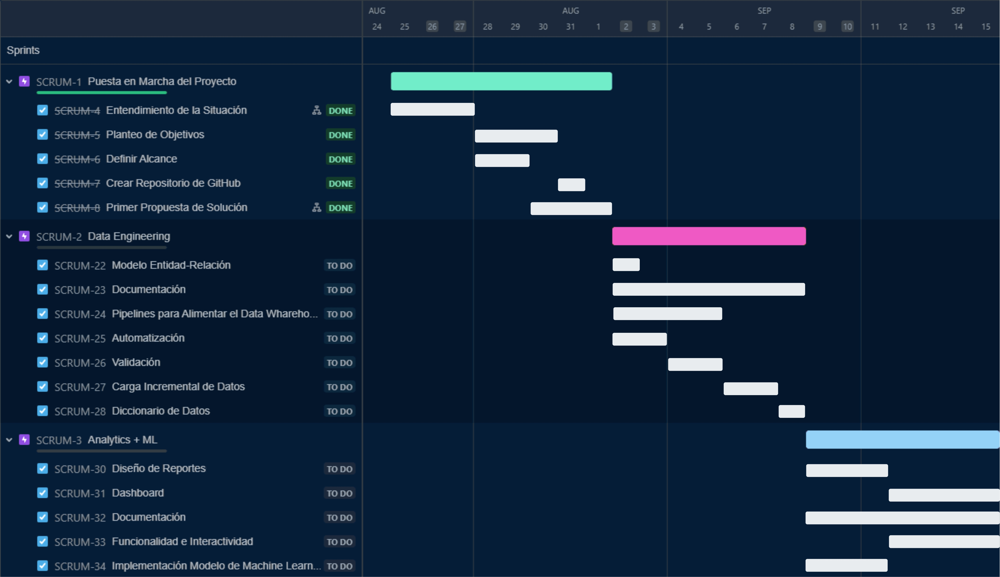

# Proyecto Final - Yelp + Google Maps

## Descripción

DATAFUSION es una consultora que surge de la necesidad creciente de aplicar ciencia de datos al análisis de negocios. Nuestro equipo trabaja incansablemente para amalgamar nivel de detalle con decisiones de negocio, logrando la perfecta fusión entre saber y hacer.

## Equipo Asignado al Proyecto

## Planteo del Proyecto

En un mercado hotelero cada vez más competitivo y centrado en la experiencia del cliente, la cadena hotelera Holiday Inn busca mejorar su enfoque en la satisfacción del cliente y la calidad del servicio. Con el objetivo de comprender a fondo la percepción de los clientes a lo largo de los años, se ha planteado la necesidad de analizar diversos aspectos de datos obtenidos de plataformas clave como Google Maps y Yelp, incluyendo las reseñas y los sentimientos expresados en las mismas.

## Navegación Rápida

- [Objetivos](#objetivos)
- [Alcance](#alcance)
- [Limitaciones](#limitaciones)
- [Metodología](#metodología)
- [Diagrama Entidad-Relación](#diagrama-entidad-relación)
- [Stack Tecnológico & Pipeline](#stack-tecnológico--pipeline)
- [KPIs - Indicadores Claves de Rendimiento Propuestos](https://github.com/MartiPeker/Proyecto-Google-Yelp/edit/main/README.md#proyecto-final---yelp--google-maps)
- [Pipeline del Proceso de ETL](#pipeline-del-proceso-de-etl)
- [Producto de Machine Learning](#producto-de-machine-learning)
- [Procesamiento de Lenguaje Natural (NLP)](#procesamiento-de-lenguaje-natural-nlp)
- [Pipeline de Carga Incremental ML](#pipeline-de-carga-incremental-ml)
- [Dashboard](#dashboard)
- [Conclusión](#conclusión)
- [Autores](#autores)
- [Advertencia](#advertencia)

## Objetivos

El proyecto se centra en el análisis de reseñas y sentimientos de los huéspedes durante el periodo de 2016-2020 en los hoteles de la cadena Holiday Inn en Estados Unidos, así como las de los competidores en las plazas en las que opera. Se recopilarán y procesarán sets de datos de las plataformas Google Maps y Yelp, extrayendo información clave sobre la experiencia de los huéspedes y los aspectos que más influyen en sus percepciones.

## Alcance

La falta de datos de calidad posteriores a la fecha mencionada dificulta la ampliación del alcance, pero se presenta como una oportunidad de continuidad. Acceso irrestricto a los diferentes endpoints de las APIs de Google y Yelp permitirían brindar a los dashboards y modelo de Machine Learning la posibilidad de actualización por lotes diaria. Siendo el foco en servicios de hospedaje, la falta de datos relativos al checkout también significan una pérdida de oportunidad para un análisis más profundo.

## Limitaciones

Las limitaciones incluyen la falta de datos de calidad posteriores a 2020 y la falta de información relativa al checkout de los huéspedes.

## Metodología 

El equipo utiliza la metodología Scrum, planificando el Sprint, sosteniendo reuniones diarias, ejecutando las tareas de desarrollo, para luego revisar cada Sprint en una Demo con el Product Owner y realizar la reflexión retrospectiva. A continuación, el ciclo vuelve a comenzar con un nuevo Sprint hasta el fin del proyecto.

## Diagrama Entidad-Relación

Pueden ver el diccionario de datos en este link(Proxiamamente)
## Stack Tecnológico & Pipeline

# KPIs - Indicadores claves de rendimiento propuestos

## Pipeline del Proceso de ETL

El proceso de Extracción, Transformación y Carga (ETL) es fundamental en nuestro proyecto para preparar y procesar los datos de manera efectiva. Este Playplan describe las diferentes etapas del proceso ETL utilizando herramientas de Google Cloud Platform (GCP).

#### 1. Data Source

En esta etapa, nuestras fuentes de datos actúan como la entrada inicial del proceso ETL. Estas fuentes contienen datos en bruto que deseamos analizar, como las reseñas de Google y Yelp, junto con otros datos relevantes para nuestro proyecto.

#### 2. Data Ingestion

Una vez que tenemos nuestras fuentes de datos, el siguiente paso es la ingestión de datos. En esta etapa, los datos se transfieren desde las fuentes a nuestro "Cloud Storage", que funciona como nuestro "Data Lake". Google Cloud Storage proporciona un lugar seguro y escalable para almacenar los datos brutos en su formato original, preservando su integridad.

#### 3. Data Processing and Exploration

En esta etapa, utilizamos BigQuery, una base de datos en la nube de GCP, para realizar consultas y análisis en los datos. Esto nos permite explorar y comprender mejor la estructura de los datos, identificar patrones y tendencias, y realizar análisis exploratorios de datos (EDA) para obtener información inicial.

#### 4. Data Transformation

Después de la exploración inicial, avanzamos a la etapa de transformación de datos. Aquí utilizamos Vertex AI Notebooks, entornos de desarrollo colaborativo basados en Jupyter Notebook, para aplicar transformaciones y limpieza avanzada a los datos. Esto incluye tareas como la lematización, la eliminación de stop words y la categorización de sentimientos, así como la ingeniería de características para mejorar el análisis.

#### 5. Data Warehouse

Finalmente, en la etapa del Data Warehouse, los datos transformados se almacenan nuevamente en BigQuery. En este punto, los datos han sido procesados, limpiados y enriquecidos, y están listos para su uso en análisis más avanzados, generación de informes o construcción de modelos de Machine Learning. Aquí podemos realizar consultas SQL complejas para extraer información específica o preparar los datos para análisis posteriores.

Este Playplan del proceso ETL en Google Cloud Platform demuestra cómo los datos se mueven desde las fuentes hasta un sistema de almacenamiento en la nube, se exploran, transforman y finalmente se almacenan en un almacén de datos listos para su análisis. Cada etapa utiliza las herramientas y servicios adecuados de GCP para garantizar un procesamiento eficiente y de alta calidad de los datos en cada paso del camino.

## Producto de Machine Learning

Utilizamos técnicas avanzadas de Procesamiento de Lenguaje Natural y Machine Learning para identificar patrones y tendencias en las opiniones de los huéspedes, categorizando las reseñas en función de su importancia y aspectos positivos y negativos. Esto permitirá generar un análisis FODA para identificar las fortalezas, oportunidades, debilidades y amenazas que emergen de los datos, tanto para nuestro cliente como para sus competidores.

### Procesamiento de Lenguaje Natural (NLP)

#### Data Acquisition

Para llevar a cabo el análisis de las opiniones de los huéspedes, adquirimos datos de las siguientes fuentes:

- **Google Reviews**: Recopilamos las reseñas de Google para los hoteles de la cadena Holiday Inn en Estados Unidos.

- **Yelp Reviews**: Extraemos las reseñas de Yelp relacionadas con estos mismos hoteles.

#### Text Cleaning

En esta etapa, aplicamos varias técnicas de limpieza de texto para preparar los datos para el análisis:

- **Regex**: Utilizamos expresiones regulares para identificar y eliminar caracteres no deseados y patrones específicos en el texto.

#### Preprocessing

##### Named Entity Recognition (NER)

Realizamos el reconocimiento de entidades nombradas para identificar elementos como nombres de lugares, nombres de personas y otros datos relevantes en el texto.

##### Stop Words

Eliminamos las palabras comunes pero poco informativas (stop words) para reducir el ruido en los datos.

##### Punctuation

Manejamos la puntuación para asegurarnos de que no afecte negativamente el análisis.

##### Selección de Entidades

Seleccionamos las entidades clave que serán el foco del análisis, como adjetivos, sustantivos y otras categorías relevantes.

##### Lematización

Lematizamos las palabras para reducirlas a su forma base, lo que facilita la comparación y el análisis.

##### Lower Casing

Convertimos todo el texto a minúsculas para evitar problemas de distinción entre mayúsculas y minúsculas.

#### Feature Engineering

Para mejorar el análisis, creamos características significativas:

- **Sintácticas**: Generamos características relacionadas con la estructura gramatical de las reseñas, como la longitud de las oraciones y la cantidad de palabras.

- **Semánticas**: Desarrollamos características que capturan el significado de las palabras, como el sentimiento positivo o negativo asociado a ellas.

- **Contextuales**: Incluimos características que consideran el contexto de las reseñas, como las palabras que suelen aparecer juntas.

#### Model Building

En esta fase, seleccionamos las librerías y métodos adecuados para el análisis:

- **Selección de Librerías**: Utilizamos librerías de procesamiento de lenguaje natural como NLTK y spaCy, así como herramientas de aprendizaje automático como scikit-learn.

- **Experimentación**: Realizamos experimentos con diferentes algoritmos de clasificación y técnicas de análisis de sentimientos para determinar la mejor aproximación.

- **Cambios de Paradigma**: Adaptamos nuestro enfoque según los resultados de los experimentos para obtener mejores resultados.

#### Evaluation

Evaluamos el rendimiento de nuestro análisis de NLP:

- **Número y Calidades de Entidades Reconocidas**: Medimos la cantidad de entidades identificadas y la calidad de la clasificación de sentimientos.

- **Categorización**: Categorizamos las reseñas en función de su contenido y sentimiento.

#### Deployment

Implementamos nuestros modelos en producción y establecemos un pipeline para la carga incremental de datos:

- **Procesamiento de Data Histórica**: Aplicamos nuestro análisis a datos históricos para obtener información retrospectiva.

- **Pipeline de Actualización Carga Incremental**: Mantenemos nuestros modelos actualizados con datos nuevos a través de un proceso de carga incremental.

## Pipeline de Carga Incremental ML

## Dashboard

Nuestro proyecto incluye un completo dashboard con cinco páginas que ofrecen información esencial y visualizaciones detalladas sobre el análisis de datos de Google y Yelp. Aquí el [link](https://drive.google.com/file/d/1R2n0_4TccsWuV58OfzbmU6vYfhQJ0pK3/view?usp=drive_link) de acceso al archivo

### Página 1 - Yelp 

En esta página, puedes encontrar los siguientes KPIs:
- Índice de Penetración del Mercado.
- Índice de Ocupación Anual y Mensual.

Además, incluimos visualizaciones como:
- Geolocalización de hoteles.
- Check-ins por día.
- Top hoteles con mayor cantidad de check-ins.
- Filtros por año y mes.

### Página 2 - Yelp 

En esta segunda página, encontrarás KPIs adicionales, como:
- Índice de Satisfacción al Cliente.
- Índice de Fidelidad.
- Índice de Influencia.
- Índice de Sentimiento Positivo.

Las visualizaciones incluyen:
- Promedio de rating en cada mes del año seleccionado.
- Top 5 hoteles con reseñas.
- Filtros por año y mes.
- Número de fans y usuarios de Holiday Inn.
- Total de reseñas en ese periodo.

### Página 3 - Google Maps

La tercera página se centra en los datos de Google y presenta KPIs como:
- Índice de Sentimiento Positivo.
- Índice de Fidelidad.
- Índice de Respuesta.
- Índice de Satisfacción al Cliente.

Además de los filtros comunes, también ofrecemos un filtro por estado. Otras visualizaciones incluyen un mapa de geolocalización y un top de hoteles con más reseñas.

### Página 4 - Yelp Analysis

La cuarta página presenta el análisis FODA basado en treemaps, que se divide en cuatro categorías: Fortalezas, Oportunidades, Debilidades y Amenazas. Este análisis se centra en los datos de Yelp.

### Página 5 - Google Analysis

La quinta página muestra el análisis FODA de Google, similar a la página anterior pero enfocado en los datos de Google.

Es importante destacar que realizamos análisis separados de los datos de Google y Yelp debido a la falta de coincidencia en los hoteles en ambos conjuntos de datos.

Este completo dashboard proporciona una visión profunda de los datos recopilados y procesados en nuestro proyecto, permitiéndote explorar y comprender mejor la percepción de los huéspedes y otros aspectos clave de los hoteles de la cadena Holiday Inn.

## Conclusión

Tras un análisis exhaustivo de los datos recopilados de Google Maps y Yelp, el análisis FODA arroja conclusiones significativas sobre la posición de Holiday Inn en el mercado hotelero. A pesar de la competencia que abarca nueve cadenas diferentes, se observa que Holiday Inn comparte fortalezas y habilidades similares con sus competidores.

La conclusión clave es que esta observación sugiere una estrategia viable para Holiday Inn: enfocarse en mejorar las áreas donde la competencia muestra debilidades. Esto podría marcar una diferencia significativa en el altamente competitivo mercado hotelero. 

Es importante destacar que este análisis FODA se basa en datos objetivos y en tendencias claras en las opiniones de los clientes, lo que le da un valor sustancial a las conclusiones.

### Acciones Futuras Recomendadas

Las acciones futuras recomendadas se basan en las conclusiones del análisis FODA y en el objetivo de mantener y mejorar la posición de Holiday Inn en el mercado. Recomendamos lo siguiente:

- **Mejorar Debilidades Identificadas**: Identificar y abordar las debilidades específicas reveladas en el análisis para elevar aún más la satisfacción del cliente.

- **Aprovechar Fortalezas Actuales**: Capitalizar las fortalezas existentes para mantener la ventaja competitiva.

- **Explotar Oportunidades**: Aprovechar las oportunidades identificadas para competir de manera más efectiva y aumentar la cuota de mercado.

- **Mitigar Amenazas en la Competencia**: Prepararse para enfrentar las amenazas identificadas en la competencia, lo que puede requerir adaptación y flexibilidad en la estrategia.

- **Seguimiento de KPIs**: Continuar monitoreando de cerca los KPIs, como el índice de satisfacción al cliente, para garantizar una mejora continua y una toma de decisiones informada.

Este dashboard brinda una visión completa de la experiencia del cliente en Holiday Inn, evaluando KPIs y realizando un análisis FODA basado en datos de Google Maps y Yelp. Las conclusiones obtenidas proporcionan una base sólida para la toma de decisiones estratégicas y acciones futuras dirigidas a mantener y mejorar la posición de Holiday Inn en el mercado hotelero.

## Autores
Los enlaces los llevaran a sus perfiles de LinkedIn.
- [M. Florencia Caro](https://www.linkedin.com/in/maria-florencia-c-86916b21/)
- [Martina Peker](https://www.linkedin.com/in/marti-peker/)
- [Naomi Larrosa](https://www.linkedin.com/in/naomi-d-larrosa-m-a27965271/)
- [Emily Cabas](https://www.linkedin.com/in/emily-cabas-660a09211/)
- [Agustín Samperi](https://www.linkedin.com/in/agustin-samperi/)

## Advertencia

Este proyecto es un ejercicio académico y de aprendizaje. Los datos utilizados, las técnicas de análisis, y cualquier resultado o conclusión presentados aquí son puramente ficticios y no deben interpretarse como representativos de la realidad. No se pretende que este proyecto tenga aplicaciones comerciales o prácticas en un entorno real. Su único propósito es demostrar habilidades y conocimientos en el campo de la ciencia de datos y el análisis de datos.

Todas las referencias a marcas, nombres de empresas o servicios son utilizadas únicamente con fines ilustrativos y no implican ninguna afiliación real con las entidades mencionadas.

Por favor, tenga en cuenta que cualquier uso o implementación de los conceptos presentados en este proyecto en un entorno real debe ser cuidadosamente evaluado y adaptado según las necesidades y requisitos específicos de la situación.

Este proyecto es resultado del esfuerzo y el trabajo del equipo mencionado anteriormente como parte de un proceso de aprendizaje y formación en ciencia de datos y análisis de datos.

¡Gracias por su comprensión y su interés en nuestro proyecto!

