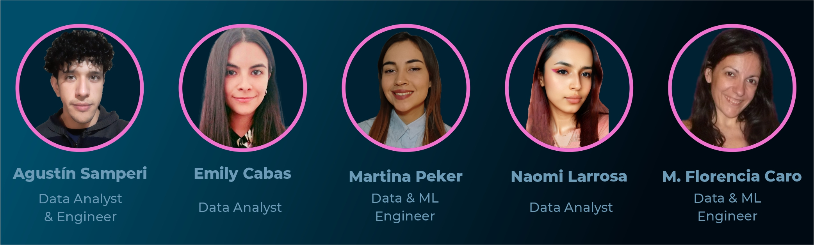

# Proyecto Final - Yelp + Google Maps

## Descripción

DATAFUSION es una consultora que surge de la necesidad creciente de aplicar ciencia de datos al análisis de negocios. Nuestro equipo trabaja incansablemente para amalgamar nivel de detalle con decisiones de negocio, logrando la perfecta fusión entre saber y hacer.

## Equipo Asignado al Proyecto

## Planteo del Proyecto

En un mercado hotelero cada vez más competitivo y centrado en la experiencia del cliente, la cadena hotelera Holiday Inn busca mejorar su enfoque en la satisfacción del cliente y la calidad del servicio. Con el objetivo de comprender a fondo la percepción de los clientes a lo largo de los años, se ha planteado la necesidad de analizar diversos aspectos de datos obtenidos de plataformas clave como Google Maps y Yelp, incluyendo las reseñas y los sentimientos expresados en las mismas.

## Objetivos

El proyecto se centra en el análisis de reseñas y sentimientos de los huéspedes durante el periodo de 2016-2020 en los hoteles de la cadena Holiday Inn en Estados Unidos, así como las de los competidores en las plazas en las que opera. Se recopilarán y procesarán sets de datos de las plataformas Google Maps y Yelp, extrayendo información clave sobre la experiencia de los huéspedes y los aspectos que más influyen en sus percepciones.

## Alcance

La falta de datos de calidad posteriores a la fecha mencionada dificulta la ampliación del alcance, pero se presenta como una oportunidad de continuidad. Acceso irrestricto a los diferentes endpoints de las APIs de Google y Yelp permitirían brindar a los dashboards y modelo de Machine Learning la posibilidad de actualización por lotes diaria. Siendo el foco en servicios de hospedaje, la falta de datos relativos al checkout también significan una pérdida de oportunidad para un análisis más profundo.

## Metodología 

El equipo utiliza la metodología Scrum, planificando el Sprint, sosteniendo reuniones diarias, ejecutando las tareas de desarrollo, para luego revisar cada Sprint en una Demo con el Product Owner y realizar la reflexión retrospectiva. A continuación, el ciclo vuelve a comenzar con un nuevo Sprint hasta el fin del proyecto.

## Stack Tecnológico & Pipeline

## Producto de Machine Learning

Utilizamos técnicas avanzadas de Procesamiento de Lenguaje Natural y Machine Learning para identificar patrones y tendencias en las opiniones de los huéspedes, categorizando las reseñas en función de su importancia y aspectos positivos y negativos. Esto permitirá generar un análisis FODA para identificar las fortalezas, oportunidades, debilidades y amenazas que emergen de los datos, tanto para nuestro cliente como para sus competidores.

# KPIs - Indicadores claves de rendimiento propuestos

## Dashboard

El Dashboard mostrará diferentes reportes e incluirá los KPIs relacionados con el proyecto.

## Limitaciones

Las limitaciones incluyen la falta de datos de calidad posteriores a 2020 y la falta de información relativa al checkout de los huéspedes.

## Autores
Los enlaces los llevaran a sus perfiles de LinkedIn.
- [M. Florencia Caro](https://www.linkedin.com/in/maria-florencia-c-86916b21/)
- [Martina Peker](https://www.linkedin.com/in/marti-peker/)
- [Naomi Larrosa](https://www.linkedin.com/in/naomi-d-larrosa-m-a27965271/)
- [Emily Cabas](https://www.linkedin.com/in/emily-cabas-660a09211/)
- [Agustín Samperi](https://www.linkedin.com/in/agustin-samperi/)

## Advertencia

Este proyecto es un ejercicio académico y de aprendizaje. Los datos utilizados, las técnicas de análisis, y cualquier resultado o conclusión presentados aquí son puramente ficticios y no deben interpretarse como representativos de la realidad. No se pretende que este proyecto tenga aplicaciones comerciales o prácticas en un entorno real. Su único propósito es demostrar habilidades y conocimientos en el campo de la ciencia de datos y el análisis de datos.

Todas las referencias a marcas, nombres de empresas o servicios son utilizadas únicamente con fines ilustrativos y no implican ninguna afiliación real con las entidades mencionadas.

Por favor, tenga en cuenta que cualquier uso o implementación de los conceptos presentados en este proyecto en un entorno real debe ser cuidadosamente evaluado y adaptado según las necesidades y requisitos específicos de la situación.

Este proyecto es resultado del esfuerzo y el trabajo del equipo mencionado anteriormente como parte de un proceso de aprendizaje y formación en ciencia de datos y análisis de datos.

¡Gracias por su comprensión y su interés en nuestro proyecto!

